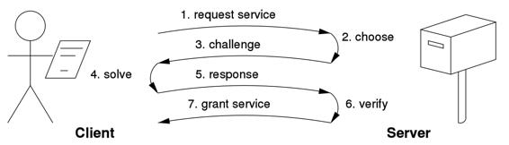

# Защита TCP-сервера от DDOS атак методом Prof of Work

## 1. Описание
Проект решает задачу защиты TCP-сервера от DDOS атак и для его реализации должны выполнятся следующие условия: 
+ Для защиты необходимо использовать метод [Prof of Work](https://en.wikipedia.org/wiki/Proof_of_work)(протокол challenge-response)
+ Выбор алгоритма POW должен быть объеснен
+ После проверки работы Prof Of Work сервер должен отправить одну из цитат из книги “Word of wisdom” или любой другой подборки цитат
+ Dockerfile должен быть предоставлен как для сервера, так и для клиента, который решает проблему POW

## 2. Введение
### 2.1 Требования
+ [Go 1.20+]()
+ [Docker]()

### 2.2 Список команд:
+ Запуск контейнеров клиента и сервера
```
make composeUp
```
+ Запуск контейнеров клиента и сервера (пересоздание контейнеров)
```
make composeRefresh
```
+ Остановка и удаление всех контейнеров
```
make composeDown
```
+ Создание бинарника
```
make build
```
+ Новый запуск контейнеров на случаи если были сделаны изменения в проекте
```
make build
make composeUp

# либо вместо вышеперечисленных комманд запускаем composeRefresh
```

## 3. Решение
### 3.1 Prof of Work
Pow это форма криптографического доказательства, при которой одна сторона (проверяющий) доказывает другим (верификаторам), что было затрачено определенное количество определенных вычислительных усилий.

### 3.2 Протокол challenge-response
Данный протокол работает следующим образом:
+ Клиент запрашивает у сервера задачу
+ Сервер генерирует задачу и отправляет клиенту
+ Клиент решает задачу и отправляет серверу
+ Сервер проверяет решение на корректность и предоставляет данные(в данном случае цитаты) клиенту



Для отправки и получение данных по TCP используется шаблон ```header|payload\n```:
+ `header` - содержить один из комманд протокола
+ `payload` - содержить данные для определенной команды

Список возможных значений:
+ запрос задачи у сервера - `request-challenge|`
+ ответ сервера с задачей для решение - `response-challenge|{"Version":1,"ZerosCount":3,"Date":1700388155,"Resource":"192.168.80.3","Rand":"ODkzNTE=","Counter":0}`
+ запрос сервера с решенной задачей для получение цитаты - `request-resource|{"Version":1,"ZerosCount":3,"Date":1700388155,"Resource":"192.168.80.3","Rand":"ODkzNTE=","Counter":3}` - 
+ ответ сервера с цитатой - `response-resource|At the end of the day you are your own lawmaker`
+ когда сервер получил некоректные данные - `fail|invalid hash cash recource`

### 3.3 Алгоритм
В качестве алгоритма был выбран алгоритм [HashCash](https://en.wikipedia.org/wiki/Hashcash). Для шифрации данный алгоритм использует следующую струкрутру:
```
{"Version":1,"ZerosCount":3,"Date":1700388155,"Resource":"192.168.80.3","Rand":"ODkzNTE=","Counter":3}
```
+ Version - версия формата HashСash
+ ZerosCount - количество нулей которое должно быть в начале хеша
+ Date - время когда было отправлено сообщение
+ Resource - IP адрес клиента
+ Rand - рандомная строка шифрованная в base64
+ Counter - количество попыток для генерации хеша

### 3.4 Тесты
Для тестирование проекта подготовлен api по HTTP с клиентом. Между клиентом и сервером соединие остается по TCP
#### API
| Method   | URL                 | Description      |
| -------- |---------------------|------------------|
| `GET`    | `/request-challenge` | Запросить задачу |
| `POST`   | `/request-resource` | Запросить цитату |

#### Примеры
URL: `/request-challenge`

Ответ 1
```json
{
   "status": "success", 
   "data": {
      "Version": 1,
      "ZerosCount": 3,
      "Date": 1700388155,
      "Resource": "192.168.80.3",
      "Rand": "ODkzNTE=",
      "Counter": 0
    }
}
```

Ответ 2
```json
{
"status": "error",
"message": "internal server error"
}
```

URL: `/request-resource`

Тело запроса
```json
{
    "Version": 1,
    "ZerosCount": 3,
    "Date": 1700411407,
    "Resource": "192.168.80.3",
    "Rand": "ODkzNTE=",
    "Counter": 0
}
```

Ответ 1
```json
{
   "status": "success",
   "data": "At the end of the day you are your own lawmaker"
}
```

Ответ 2
```json
{
"status": "error",
"message": "internal server error"
}
```

Ответ 3
```json
{
   "status": "fail",
   "message": "challenge expired or not sent"
}
```

#### Статус коды

| Status    | Description                                |
|-----------|--------------------------------------------|
| `success` | Успешно получили цитату                    |
| `fail`    | Невалидные данные были отправлены в запросе |
| `error`   | Серверная ошибка                           |

## 4. Структура проекта
```
.
├── cmd                       запуск сервисов
├── config                    конфигурационные файлы
├── internal                  приватный модуль проекта
│   ├── application           главный интерфейс(для вызовов методов сервисов)
│   ├── handler               контроллер
│   │   ├── client            обработчик клиента (http, tcp)
│   │   ├── server            обработчик сервера (tcp)
│   ├── service               бизнес логика
│   │    ├── client           локига клиента
│   │    ├── server           логика сервера
├── lib                       библиотеки
│   ├── cache                 кэширование задач клиента
│   ├── goerrors              обработка логов
│   ├── pow                   алгоритм Pow (Hashcash)
│   └── protocol              протоколы Pow для взаимодействия по TCP
│       └── challenge_resp    протокол challenge-response
└──-----------------------------------------------------------------
```